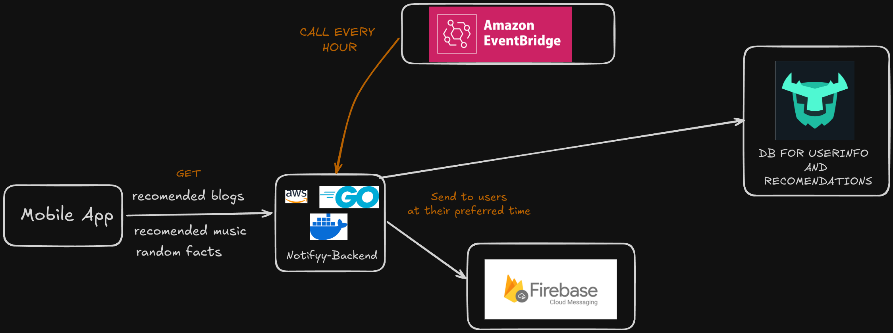

# Notifyy Backend

The backend for Notifyy is built using Go with the Gin framework, leveraging Turso as the database and Firebase for sending notifications. A cron job runs every hour to determine which users should receive notifications, ensuring timely and relevant messages.

## Features

- **Go-Powered Backend**: Efficient and fast backend developed with Go and the Gin framework, ensuring high performance and low latency.
- **Turso Database**: Uses Turso for managing user data, notification schedules, and preferences.
- **Firebase Integration**: Utilizes Firebase for sending push notifications directly to users.
- **Hourly Cron Job**: A cron job runs every hour to check which users should receive notifications, maintaining consistent engagement.
- **Scalable Design**: Designed to handle multiple users and scale effortlessly as the app grows.

## Technologies Used

- **Go**: Core backend language, chosen for its speed and simplicity.
- **Gin**: Lightweight and fast web framework for building the API.
- **Turso**: Modern, edge-optimized database used for storing user data and notification schedules.
- **Firebase**: Handles sending of push notifications to users in real time.
- **Cron Job**: Runs hourly to query the database and send notifications to relevant users.

## Architecture Overview

1. **User Data Management**: User data, including notification preferences and schedules, are stored in Turso.
2. **Notification Scheduling**: The backend calculates when and to whom notifications should be sent.
3. **Push Notifications**: Uses Firebase to send notifications directly to user devices.
4. **Gin Framework**: Provides a lightweight API to manage user interactions and notifications.
5. **Cron Job Execution**: Runs every hour to determine notification recipients based on user preferences and schedules.

Memory updated
Here's the updated README for the Notifyy backend, incorporating the use of the Gin framework:

markdown
Copy code
# Notifyy Backend

The backend for Notifyy is built using Go with the Gin framework, leveraging Turso as the database and Firebase for sending notifications. A cron job runs every hour to determine which users should receive notifications, ensuring timely and relevant messages.

## Features

- **Go-Powered Backend**: Efficient and fast backend developed with Go and the Gin framework, ensuring high performance and low latency.
- **Turso Database**: Uses Turso for managing user data, notification schedules, and preferences.
- **Firebase Integration**: Utilizes Firebase for sending push notifications directly to users.
- **Hourly Cron Job**: A cron job runs every hour to check which users should receive notifications, maintaining consistent engagement.
- **Scalable Design**: Designed to handle multiple users and scale effortlessly as the app grows.

## Technologies Used

- **Go**: Core backend language, chosen for its speed and simplicity.
- **Gin**: Lightweight and fast web framework for building the API.
- **Turso**: Modern, edge-optimized database used for storing user data and notification schedules.
- **Firebase**: Handles sending of push notifications to users in real time.
- **Cron Job**: Runs hourly to query the database and send notifications to relevant users.

## Architecture Overview

1. **User Data Management**: User data, including notification preferences and schedules, are stored in Turso.
2. **Notification Scheduling**: The backend calculates when and to whom notifications should be sent.
3. **Push Notifications**: Uses Firebase to send notifications directly to user devices.
4. **Gin Framework**: Provides a lightweight API to manage user interactions and notifications.
5. **Cron Job Execution**: Runs every hour to determine notification recipients based on user preferences and schedules.

## Contributing
Contributions are welcome! If you'd like to add new features, improve existing ones, or fix bugs, please fork the repository and submit a pull request.

- Fork the project
- Create your feature branch (git checkout -b feature/NewFeature)
- Commit your changes (git commit -m 'Add New Feature')
- Push to the branch (git push origin feature/NewFeature)
- Open a pull request

## Contact
For questions or feedback, feel free to reach out at:
- **Author**: Subinoy Biswas
- **GitHub**: [subinoybiswas](https://github.com/subinoybiswas)
